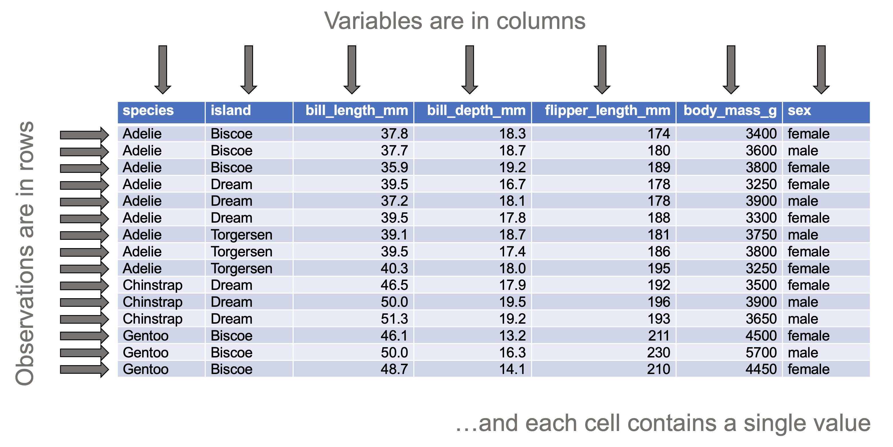
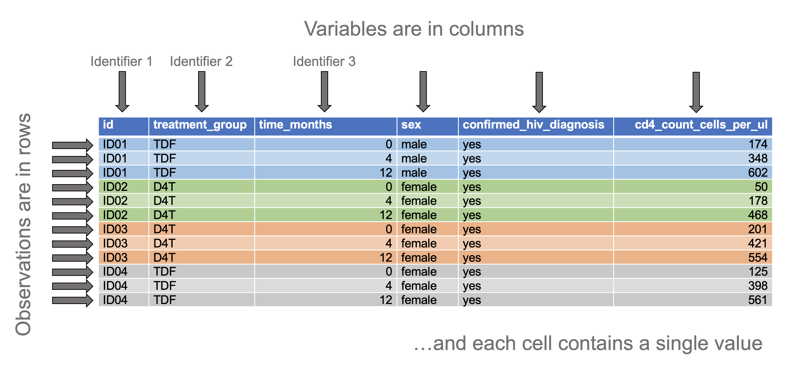

```{r setup, include = FALSE}
library(flexdashboard)
library(shiny)
library(shinyjqui)
library(ggplot2)
library(ggthemes)
library(vcdExtra)
library(tidyr)
library(tibble)
library(parameters)
library(readxl)
library(readr)
library(skimr)
library(gmodels)
library(janitor)
library(rstatix)
library(boot)
library(dplyr)

# skimr variables
my_skim <- skim_with(base = sfl(Missing = n_missing,
                                Complete = n_complete),
                     numeric = sfl(mean = NULL, sd = NULL,
                                   p0 = NULL, p25 = NULL, p50 = NULL, 
                                   p75 = NULL, p100 = NULL, hist = NULL,
                                   Mean = ~ mean(., na.rm = TRUE),
                                   SD = ~ sd(., na.rm = TRUE),
                                   Min = ~ min(., na.rm = TRUE),
                                   Q1 = ~ quantile(., probs = 0.25, na.rm = TRUE),
                                   Median = ~ quantile(., probs = 0.5, na.rm = TRUE),
                                   Q3 = ~ quantile(., probs = 0.75, na.rm = TRUE),
                                   Max = ~max(., na.rm = TRUE)),
                     factor = sfl(ordered = NULL,
                                  top_counts = NULL,
                                  `Top 3 levels` = ~ top_counts(., 
                                                                max_char = 15,
                                                                max_levels = 3)))
```

```{r eval = FALSE}
# Packages
library(tidyverse)
library(palmerpenguins)
library(lme4)

# Datasets
## Long format
### Iris
iris %>% 
    write_csv(file = 'data/iris_original.csv')

### Penguins
penguins %>% 
    write_csv(file = 'data/penguins_orginal.csv')

### Sleep study
sleepstudy %>% 
    as_tibble() %>% 
    rename(reaction_time_ms = Reaction,
           sleep_deprivation_days = Days,
           participant = Subject) %>% 
    write_csv(file = 'data/sleepstudy_original.csv')

### Sleep
sleep %>% 
    as_tibble() %>%
    select(ID, group, extra) %>% 
    mutate(group = ifelse(group == 1,
                          yes = 'A',
                          no = 'B')) %>% 
    setNames(nm = c('participant', 'drug', 'extra_sleep_hours')) %>% 
    write_csv(file = 'data/sleep_cleaned.csv')

#### Modified to one group only
sleep %>% 
    as_tibble() %>%
    filter(group == 1) %>% 
    select(ID, extra) %>% 
    setNames(nm = c('participant', 'extra_sleep_hours')) %>% 
    write_csv(file = 'data/sleep_group_1.csv')

### mtcars
#### Reduced number of variables
#### Cleaned column names
mtcars %>% 
    rownames_to_column(var = 'cars') %>% 
    as_tibble() %>% 
    select(cars, mpg, cyl, wt, hp, disp, am) %>% 
    setNames(nm = c('car', 'miles_per_gallon', 'number_of_cylinders',
                    'weight_1000lbs', 'gross_horsepower', 
                    'displacement_cubic.inches',
                    'transmission')) %>% 
    mutate(transmission = ifelse(transmission == 0,
                                 yes = 'automatic',
                                 no = 'manual')) %>% 
    write_csv(file = 'data/mtcars_cleaned.csv')

### Infertility
#### Reduced number of variables
#### Cleaned column names
infert %>% 
    as_tibble() %>% 
    select(case, education, age, parity, induced, spontaneous) %>% 
    mutate(case = ifelse(case == 1,
                         yes = 'case',
                         no = 'control'),
           induced = case_when(
               induced == 0 ~ '0',
               induced == 1 ~ '1',
               induced == 2 ~ '2 or more'
           ),
           spontaneous = case_when(
               spontaneous == 0 ~ '0',
               spontaneous == 1 ~ '1',
               spontaneous == 2 ~ '2 or more'
           )) %>% 
    setNames(nm = c('group', 'years_of_education', 'age_years', 
                    'parity', 'number_of_induced_abortions',
                    'number_of_spontaneous_abortions')) %>% 
    write_csv('data/infertility_cleaned.csv')

### Smokers
#### 25 non-smokers and 25 smokers watched an emotive video showing the 
#### impact that deaths from smoking-related cancers had on families
#### Smoking status assessed before and two-weeks after watching the video

smokers <- read_csv('data/smokers_original.csv')
smokers %>% 
    as_tibble() %>% 
    mutate(participant_ID = 1:50) %>% 
    select(participant_ID, Before, After) %>% 
    setNames(nm = c('participant_ID', 
                    'smoking_status_before_intervention', 
                    'smoking_status_after_intervention')) %>%
    mutate(smoking_status_before_intervention =
               ifelse(smoking_status_before_intervention == 0,
                      yes = 'non-smoker',
                      no = 'smoker'),
           smoking_status_after_intervention = 
               ifelse(smoking_status_after_intervention == 0,
                      yes = 'non-smoker',
                      no = 'smoker')) %>% 
    write_csv('data/smokers_cleaned.csv')
```

Welcome {data-nav='Welcome'}
===================================== 

<!--- <a href='https://www.wits.ac.za' target='_blank'>

</a> --->

**Welcome**  

The app provides basic statistical tests (e.g., t-test, ANOVA, correlation, linear regression)

To plot your data, please use the companion app, [`plotr`](https://kamermanpr.shinyapps.io/painblogr-plotr/){ target='_blank' }

**Steps to analysing your data**  

- Go to the _"Upload data"_ page, upload your data and choose the variables according to whether they are numeric values or categorical values

- Once the data have been uploaded and variables selected, choose the type of analysis you want from the drop-down menu labelled _“Analysis”_.

- Select the variables to analyse and summary information, basic plots, and the results of the statistical test will be auto-generated.

**Data format**  

Only comma-separated values (CSV) and MS Excel (XLSX and XLS) files can be uploaded. The first row of the file must be column headings, and for repeated measure study designs, at least one of the columns must provide observation IDs (e.g., unique participant/patient numbers). Lastly, the data must be "tidy". 

By "tidy", we mean that the data must be arranged in "long" format such that:

- Each row contains data from an observation. Where data are collected from the same individuals on multiple occasions, each observation of an individual must be placed in a separate row (see the "Tidy data with repeated measures" example below).  

- Each column contains only one variable.

- Each value must have its own cell

<div>
<p>
<strong>Tidy data</strong>
</p>

</div>

<div>
<p>
<strong>Tidy data with repeated measures</strong>
</p>

</div>

For a full description of tidy data, please use the following [link](https://www.jstatsoft.org/article/view/v059i10){ target='_blank' }.

To download a dataset to play around with on the app, we recommend [Allison Horst's](https://allisonhorst.github.io/palmerpenguins/index.html){ target='_blank' } "Palmer Penguins" dataset ([link to data](https://drive.google.com/open?id=1-8H1Mz2_oEMu3zlVsatraFruJQlCFqZ9&authuser=peter.kamerman%40gmail.com&usp=drive_fs){ target='_blank' })

**Developers**  

The app was developed by Peter Kamerman (WWW: [painblogr.org](https://www.painblogr.org){ target='_blank'}, GitHub: [kamermanpr](https://github.com/kamermanpr){ target='_blank' }).

Please cite this app as: Kamerman PR (2022). statr: online statistical tests. Version: 0.2. DOI: [10.5281/zenodo.6302902](https://doi.org/10.5281/zenodo.6302902).

**License**  

The software is released under an [MIT license](https://github.com/kamermanpr/painblogr-statr/blob/main/LICENSE){ target='_blank' }.

**Issues**

To report any issues you have with the app, please use the following [link](https://github.com/kamermanpr/painblogr-statr/issues){ target='_blank' }.

**Software citations**

- R Core Team (2021). R: A language and environment for statistical computing. R Foundation for Statistical Computing, Vienna, Austria. URL: [https://www.R-project.org/](https://www.R-project.org/){ target='_blank' }.

- Jeffrey B. Arnold (2021). ggthemes: Extra Themes, Scales and Geoms for 'ggplot2'. R package version 4.2.4. URL: [https://CRAN.R-project.org/package=ggthemes](https://CRAN.R-project.org/package=ggthemes){ target='_blank' }.

- Angelo Canty and Brian Ripley (2021). boot: Bootstrap R (S-Plus) functions. R package version 1.3-28. URL: [https://CRAN.R-project.org/package=boot](https://CRAN.R-project.org/package=boot){ target='_blank' }
  
- Winston Chang, Joe Cheng, JJ Allaire, Carson Sievert, Barret Schloerke, Yihui Xie, Jeff Allen, Jonathan McPherson, Alan Dipert and Barbara Borges (2021). shiny: Web Application Framework for R. R package version 1.7.1. URL: [https://CRAN.R-project.org/package=shiny](https://CRAN.R-project.org/package=shiny){ target='_blank' }.

- Sam Firke (2021). janitor: Simple Tools for Examining and Cleaning Dirty Data. R package version 2.1.0. URL: [https://CRAN.R-project.org/package=janitor](https://CRAN.R-project.org/package=janitor){ target="_blank" }

- Michael Friendly (2022). vcdExtra: 'vcd' Extensions and Additions. R package version 0.7-6. [https://CRAN.R-project.org/package=vcdExtra](https://CRAN.R-project.org/package=vcdExtra){ target='_blank' }.
  
- Lionel Henry and Hadley Wickham (2021). rlang: Functions for Base Types and Core R and 'Tidyverse' Features. R package version 0.4.12. URL: [https://CRAN.R-project.org/package=rlang](https://CRAN.R-project.org/package=rlang){ target='_blank' }.

- Richard Iannone, JJ Allaire and Barbara Borges (2020). flexdashboard: R Markdown Format for Flexible Dashboards. R package version 0.5.2. URL: [https://CRAN.R-project.org/package=flexdashboard](https://CRAN.R-project.org/package=flexdashboard){ target='_blank' }.

- Alboukadel Kassambara (2021). rstatix: Pipe-Friendly Framework for Basic
  Statistical Tests. R package version 0.7.0. URL: [https://CRAN.R-project.org/package=rstatix](https://CRAN.R-project.org/package=rstatix){ target="_blank" }

- Daniel Lüdecke, Mattan Ben-Shachar, Indrajeet Patil and Dominique Makowski (2020). Extracting, Computing and Exploring the Parameters of Statistical Models using R. _Journal of Open Source Software_ *5*: 2445. DOI: [10.21105/joss.02445](https://doi.org/10.21105/joss.02445){ target="_blank" }

- Kirill Müller and Hadley Wickham (2021). tibble: Simple Data Frames. R package version 3.1.6. URL: [https://CRAN.R-project.org/package=tibble](https://CRAN.R-project.org/package=tibble){ target="_blank" }

- Yang Tang (2022). shinyjqui: 'jQuery UI' Interactions and Effects for Shiny. R package version 0.4.1. URL: [https://CRAN.R-project.org/package=shinyjqui](https://CRAN.R-project.org/package=shinyjqui){ target="_blank" }

- Elin Waring, Michael Quinn, Amelia McNamara, Eduardo Arino de la Rubia, Hao Zhu and Shannon Ellis (2021). skimr: Compact and Flexible Summaries of Data. R package version 2.1.3. URL: [https://CRAN.R-project.org/package=skimr](https://CRAN.R-project.org/package=skimr){ target='_blank' }.

- Hadley Wickham, Romain François, Lionel Henry and Kirill Müller (2021). dplyr: A Grammar of Data Manipulation. R package version 1.0.7. URL: [https://CRAN.R-project.org/package=dplyr](https://CRAN.R-project.org/package=dplyr){ target='_blank' }.

- Hadley Wickham, Jim Hester and Jennifer Bryan (2021). readr: Read Rectangular Text Data. R package version 2.1.1. URL: [https://CRAN.R-project.org/package=readr](https://CRAN.R-project.org/package=readr){ target='_blank' }.

- Hadley Wickham (2021). tidyr: Tidy Messy Data. R package version 1.1.4. URL: [https://CRAN.R-project.org/package=tidyr](https://CRAN.R-project.org/package=tidyr){ target='_blank' }.

- Hadley Wickham and Jennifer Bryan (2019). readxl: Read Excel Files. R package version 1.3.1. URL: [https://CRAN.R-project.org/package=readxl](https://CRAN.R-project.org/package=readxl){ target='_blank' }.

- Hadley Wickham (2016). ggplot2: Elegant Graphics for Data Analysis. Springer-Verlag, New York.

Upload data {data-nav='Upload data'}
=====================================

Column {.sidebar data-width=350}
-------------------------------------

```{r upload_1}
h1('Upload data')

p('Once the data have been uploaded, choose all variables that should be treated as numeric variables, and all variables that should be treated as categorical variables.')

hr()

# File format
radioButtons(inputId = 'type0', 
             label = 'File type', 
             choices = c('CSV (default)' = 'csv',
                         'XLSX or XLS' = 'excel'),
             selected = 'csv')

# Upload file
fileInput(inputId = 'file0', 
          label = 'Import data',
          multiple = FALSE,
          accept = c('.csv', '.xlsx', '.xls'))

# Make reactive data
df <- reactive({
    req(input$file0)
    
    if(input$type0 == 'csv'){
        
        read_csv(input$file0$datapath) %>% 
            clean_names()
        
    } else if(input$type0 != 'csv'){
        
        read_excel(input$file0$datapath) %>% 
            clean_names()
        
    }
})

# Choose numeric columns
output$data_numeric <- renderUI({
    varSelectizeInput(inputId = 'numeric',
                      label = 'Select numeric variables',
                      multiple = TRUE,
                      data = df())
})

uiOutput('data_numeric')

# Choose categorical columns
output$data_categorical <- renderUI({
    varSelectizeInput(inputId = 'categorical',
                      label = 'Select categorical variables (nominal and ordinal)',
                      multiple = TRUE,
                      data = df())
})

uiOutput('data_categorical')

```

Row 
-------------------------------------

### Table 1: Summary of numeric variables

```{r upload_2}
df_numeric <- reactive({
    req(df())
    df() %>% 
        select(!!!input$numeric) %>% 
        mutate(across(.cols = everything(), ~ as.numeric(.x)))
})

output$tbl_numeric <- renderTable({
    
    if(ncol(df_numeric()) != 0){
        
        df_numeric() %>% 
            my_skim() %>% 
            yank('numeric') %>% 
            rename(Variable = skim_variable)
        
    }
}, digits = 3)

tableOutput('tbl_numeric')
```

### Table 2: Summary of categorical variables

```{r upload_3}
df_categorical <- reactive({
    
    req(df())
    
    df() %>% 
        select(!!!input$categorical) %>% 
        mutate(across(.cols = everything(), ~ factor(.x)))
    
})

output$tbl_categorical <- renderTable({
    
    if(ncol(df_categorical()) != 0){
        
        df_categorical() %>% 
            my_skim() %>% 
            yank('factor') %>% 
            rename(Variable = skim_variable,
                   `Unique levels` = n_unique)
        
    }
}, digits = 3)

tableOutput('tbl_categorical')
```

```{r upload_4}
# Generate combined data file
df_combined <- reactive({
    
    bind_cols(df_numeric(), df_categorical())
    
    })
```

General linear models 1: Continuous y ~ Categorical x {data-navmenu='Analysis'}
=====================================  

Inputs {.sidebar data-width=350}
-------------------------------------

```{r continuous_v_categorical_1}
h1('General linear models 1')

p(span(style="font-size:150%;", 'Continuous y ~ categorical x'))

p(span(style="font-size:125%;", '(ANOVA, t-test)'))

p('For convenience, the non-parametric versions of the tests can be implemented by selecting', em("'Distribution free (non-parametric)'"), 'under the', em("'Choose test type'"), 'drop-down menu once the data have be uploaded.')

p(strong('Remember to upload your data first.'))

hr()

# Select variables
## Response variable
output$yvar <- renderUI({
    
    req(df_numeric())
    
    varSelectInput(inputId = 'y_var',
                   label = 'Choose continuous response (y) variable',
                   selected = NULL,
                   data = df_numeric())
    
    })

uiOutput('yvar')

## Grouping variable
output$groupvar <- renderUI({
    
    req(df_categorical())
    
    varSelectInput(inputId = 'group_var',
                   label = 'Choose categorical grouping (x) variable (in the case of one-sample tests, the variable must have one level only)',
                   selected = NULL,
                   data = df_categorical())
    
    })

uiOutput('groupvar')

# Set mu level for one-sample tests
output$muvalue <- renderUI({
    
    req(df_combined())
    
    numericInput(inputId = 'mu_value',
                 label = 'Choose the true value of the mean/location shift for one-sample tests',
                 value = 0)
    
})

uiOutput('muvalue')

# Select unique identifier variable
output$idvar <- renderUI({
    
    req(df_categorical())
    
    selectInput(inputId = 'id_var',
                label = 'Optional: Choose repeated measures identifier (e.g., participant ID)',
                selected = 'None',
                choices = c('None', names(df_categorical())))
    
    })

uiOutput('idvar')

# Select test type
output$testtype <- renderUI({
    
    req(df_analysis())
    
    selectInput(inputId = 'test_type',
                label = 'Choose test type',
                selected = 'parametric',
                choices = c('Parametric' = 'parametric',
                            'Distribution free (non-parametric)' = 'nonparametric'))
    
    })

uiOutput('testtype')

p(span(style="font-size:125%;", 'Additional options'))

# Select whether to calculate effect size
checkboxInput(inputId = 'effect_size',
              label = 'Calculate effect size (Note: bias-corrected and accelerated bootstrapped 95% confidence intervals, with 1000 replications, so calculation can take a while to perform...be patient)',
              value = FALSE)
 
# Select whether to perform pairwise tests 
checkboxInput(inputId = 'pairwise_tests',
              label = 'Perform pairwise tests (Only relevent when the grouping variable has more the two levels)',
              value = FALSE)
```

```{r continuous_v_categorical_2}
df_analysis <- reactive({
    
    req(input$group_var)
    req(input$y_var)
    req(input$id_var)
    
    if(input$id_var == 'None'){
        
        df_combined() %>% 
            select(!!!input$y_var, !!!input$group_var) %>% 
            setNames(nm = c('y_variable', 'x_variable'))
        
    } else {
        
        df_combined() %>% 
            select(!!!input$id_var, !!!input$y_var, !!!input$group_var) %>% 
            setNames(nm = c('ID', 'y_variable', 'x_variable'))
        
    }
})
```

Column
-------------------------------------

### Tabulated summary: Continuous (y) variable stratified by the grouping (x) variable

```{r continuous_v_categorical_3}
output$tbl_stratified <- renderTable({
    
    if(ncol(df_analysis()) != 0){
        
        df_analysis() %>% 
            group_by(x_variable) %>% 
            my_skim() %>% 
            yank('numeric') %>% 
            select(-skim_variable) %>% 
            rename(Group = x_variable)
        
    }
}, digits = 3)

tableOutput('tbl_stratified')
```

### Data visualisation: Continuous (y) variable stratified by the grouping (x) variable

```{r continuous_v_categorical_4}
output$boxplot <- renderPlot(
    
    if(ncol(df_analysis()) != 0){
        
        par(pty = 's')
        with(df_analysis(), boxplot(y_variable ~ x_variable,
                                    na.rm = TRUE,
                                    xlab = NULL,
                                    ylab = 'Y variable'))
        abline(h = input$mu_value, 
               col = 'red')
        
    }
)
    
plotOutput('boxplot')
```

### Model summary

```{r continuous_v_categorical_5}
output$test1 <- renderTable({
    
    if(req(input$id_var) == 'None'){
        
        if(length(levels(df_analysis()$x_variable)) == 1){
            
            if(input$test_type == 'parametric'){
                
                df_analysis() %>% 
                    t_test(y_variable ~ 1,
                           mu = input$mu_value,
                           detailed = TRUE) %>% 
                    select(method, alternative, group2, estimate, 
                           conf.low, conf.high, statistic, df, p) %>% 
                    mutate(p = round(p, 5),
                           method = 'One-sample t-test',
                           alternative = 'Two-sided',
                           group2 = input$mu_value) %>% 
                    setNames(nm = c('Test', 'Alternative', 'Null value', 
                                    'Group 1: mean', '95% CI lower limit',
                                    '95% CI upper limit',
                                    'Statistic', 'DF', 'p-value'))
                
                
            } else if(input$test_type == 'nonparametric'){
                
                df_analysis() %>% 
                    wilcox_test(y_variable ~ 1, 
                                mu = input$mu_value,
                                detailed = TRUE) %>% 
                    select(method, alternative, group2, estimate, 
                           conf.low, conf.high, 
                           statistic, p) %>% 
                    mutate(p = round(p, 5),
                           method = 'One-sample Wilcoxon rank-sum test',
                           alternative = 'Two-sided',
                           group2 = input$mu_value) %>% 
                    setNames(nm = c('Test', 'Alternative', 'Null value', 
                                    'Group 1: pseudomedian', 
                                    '95% CI lower limit', '95% CI upper limit',
                                    'Statistic', 'p-value'))
                    
            }
        
        } else if(length(levels(df_analysis()$x_variable)) == 2){
            
            if(input$test_type == 'parametric'){
            
                df_analysis() %>% 
                    t_test(y_variable ~ x_variable,
                           detailed = TRUE) %>% 
                    select(method, alternative, group1, group2, estimate1, 
                           estimate2, estimate, conf.low, conf.high, 
                           statistic, df, p) %>% 
                    mutate(p = round(p, 5),
                           method = "Welch's two-sample t-test",
                           alternative = 'Two-sided') %>% 
                    setNames(nm = c('Test', 'Alternative', 'Group 1', 'Group 2', 
                                    'Group 1: mean', 'Group 2: mean', 
                                    'Delta means', 
                                    'Delta means 95% CI lower limit',
                                    'Delta means 95% CI upper limit',
                                    'Statistic', 'DF', 'p-value'))
            
            } else if(input$test_type == 'nonparametric'){
                
                df_analysis() %>% 
                    wilcox_test(y_variable ~ x_variable,
                                detailed = TRUE) %>% 
                    select(method, alternative, group1, group2, 
                           estimate, conf.low, conf.high, 
                           statistic, p) %>% 
                    mutate(p = round(p, 5),
                           method = 'Two-sample Wilcoxon rank-sum test',
                           alternative = 'Two-sided') %>%
                    setNames(nm = c('Test', 'Alternative', 'Group 1', 
                                    'Group 2', 'Difference in location', 
                                    '95% CI lower limit',
                                    '95% CI upper limit',
                                    'Statistic', 'p-value'))
                
            }
            
        } else if(length(levels(df_analysis()$x_variable)) > 2){
            
            if(input$test_type == 'parametric'){
            
                oneway_anova <- 
                    df_analysis() %>% 
                    anova_test(y_variable ~ x_variable, 
                               type = 2,
                               detailed = TRUE)
                
                tibble(Method = 'One-way ANOVA',
                       DFn = oneway_anova$DFn,
                       DFd = oneway_anova$DFd,
                       Statistic = oneway_anova$`F`,
                       `p-value` = round(oneway_anova$p, 5))
            
            } else if(input$test_type == 'nonparametric'){
                
                df_analysis() %>% 
                    kruskal_test(as.numeric(y_variable) ~ factor(x_variable)) %>% 
                    select(method, statistic, df, p) %>%
                    mutate(method = 'Kruskal-Wallis test',
                           p = round(p, 5)) %>% 
                    setNames(nm = c('Method', 'Statistic', 'DF', 'p-value'))
                
            }
        }
        
    } else if(req(input$id_var) != 'None') {
        
        if(length(levels(df_analysis()$x_variable)) == 2){
            
            if(input$test_type == 'parametric'){
            
                df_analysis() %>% 
                    t_test(y_variable ~ x_variable,
                           paired = TRUE,
                           detailed = TRUE) %>% 
                    select(method, alternative, group1, group2, 
                           estimate, conf.low, conf.high, 
                           statistic, df, p) %>% 
                    mutate(p = round(p, 5),
                           method = "Paired t-test",
                           alternative = 'Two-sided') %>% 
                    setNames(nm = c('Test', 'Alternative', 'Group 1', 'Group 2', 
                                    'Delta means', 
                                    'Delta means 95% CI lower limit',
                                    'Delta means 95% CI upper limit',
                                    'Statistic', 'DF', 'p-value'))
            
            } else if(input$test_type == 'nonparametric'){
                
                df_analysis() %>% 
                    wilcox_test(y_variable ~ x_variable,
                                paired = TRUE,
                                detailed = TRUE) %>% 
                    select(method, alternative, group1, group2, 
                           estimate, conf.low, conf.high, 
                           statistic, p) %>% 
                    mutate(p = round(p, 5),
                           method = 'Wilcoxon signed-rank test',
                           alternative = 'Two-sided') %>%
                    setNames(nm = c('Test', 'Alternative', 'Group 1', 
                                    'Group 2', 'Difference in location', 
                                    '95% CI lower limit',
                                    '95% CI upper limit',
                                    'Statistic', 'p-value'))
                    
            }
            
        } else if(length(levels(df_analysis()$x_variable)) > 2){
            
            if(input$test_type == 'parametric'){
                
                oneway_rm_anova <- df_analysis() %>% 
                    anova_test(dv = y_variable,
                               wid = ID,
                               within = x_variable,
                               type = 2,
                               detailed = TRUE)
                
                tibble(Method = 'One-way repeated measures ANOVA',
                       DFn = oneway_rm_anova$ANOVA$DFn[[2]],
                       DFd = oneway_rm_anova$ANOVA$DFd[[2]],
                       Statistic = oneway_rm_anova$ANOVA$`F`[[2]],
                       `p-value` = round(oneway_rm_anova$ANOVA$p[[2]], 5),
                       `Mauchly's Test for Sphericity (Statistic)` = oneway_rm_anova$`Mauchly's Test for Sphericity`$W,
                       `p-value [M]` = round(oneway_rm_anova$`Mauchly's Test for Sphericity`$p, 5),
                       `Sphericity correction (Geenhouse-Geisser epsilon)` = oneway_rm_anova$`Sphericity Corrections`$GGe,
                       `DF(n,d) [GG]` = oneway_rm_anova$`Sphericity Corrections`$`DF[GG]`,
                       `p-value [GG]` = round(oneway_rm_anova$`Sphericity Corrections`$`p[GG]`, 5))
                
            } else if(input$test_type == 'nonparametric'){
                
                df_analysis() %>% 
                    friedman_test(y_variable ~ x_variable | ID) %>%
                    mutate(Test = 'Friedman test',
                           p = round(p, 5)) %>% 
                    select(Test, n, statistic, df, p) %>%
                    setNames(nm = c('Test', 'N', 'Statistic', 'DF', 'p-value'))
                
            }
        }
    }
}, digits = 3)

tableOutput('test1')
```

### Standardised effect size

```{r continuous_v_categorical_6}
output$effect1 <- renderTable({
    
    if(req(input$id_var) == 'None' & req(input$effect_size) == TRUE){
        
        if(length(levels(df_analysis()$x_variable)) == 1){
            
            if(input$test_type == 'parametric'){
                
                df_analysis() %>% 
                    cohens_d(y_variable ~ 1,
                             mu = input$mu_value,
                             ci = TRUE, 
                             ci.type = 'bca') %>% 
                    mutate(measure = "Cohen's d",
                           group2 = input$mu_value) %>% 
                    select(measure, group1, group2, n, effsize, 
                           conf.low, conf.high) %>% 
                    setNames(nm = c('Measure', 'Group 1', 'Null value', 
                                    'N', 'Effect size', '95% CI lower limit',
                                    '95% CI upper limit'))
                
            } else if(input$test_type == 'nonparametric'){
                
                df_analysis() %>% 
                    wilcox_effsize(y_variable ~ 1, 
                                   mu = input$mu_value,
                                   ci = TRUE,
                                   ci.type = 'bca') %>% 
                    mutate(measure = "Wilcoxon effect size (r)",
                           group2 = input$mu_value) %>% 
                    select(measure, group1, group2, n, effsize, 
                           conf.low, conf.high) %>% 
                    setNames(nm = c('Measure', 'Group 1', 'Null value', 'N', 
                                    'Effect size', '95% CI lower limit',
                                    '95% CI upper limit'))
                    
            }
        
        } else if(length(levels(df_analysis()$x_variable)) == 2){
            
            if(input$test_type == 'parametric'){
            
                df_analysis() %>% 
                    cohens_d(y_variable ~ x_variable,
                             ci = TRUE,
                             ci.type = 'bca') %>% 
                    mutate(measure = "Cohen's d") %>% 
                    select(measure, group1, group2, n1, n2, effsize, 
                           conf.low, conf.high) %>% 
                    setNames(nm = c('Measure', 'Group 1', 'Group 2', 
                                    'N 1', 'N 2', 'Effect size', 
                                    '95% CI lower limit', '95% CI upper limit'))
            
            } else if(input$test_type == 'nonparametric'){
                
                df_analysis() %>% 
                    wilcox_effsize(y_variable ~ x_variable,
                                   ci = TRUE,
                                   ci.type = 'bca') %>% 
                    mutate(measure = "Wilcoxon effect size (r)") %>% 
                    select(measure, group1, group2, n1, n2, effsize, 
                           conf.low, conf.high) %>% 
                    setNames(nm = c('Measure', 'Group 1', 'Group 2', 'N 1', 'N2', 
                                    'Effect size', '95% CI lower limit',
                                    '95% CI upper limit'))
                
            }
            
        } else if(length(levels(df_analysis()$x_variable)) > 2){
            
            if(input$test_type == 'parametric'){
            
                anova_eta <- eta_squared(aov(y_variable ~ x_variable, 
                                             data = df_analysis()))
                
                eta_boot <- function(d, i){
                    data <- d[i, ]
                    aov_model <- aov(y_variable ~ x_variable, data = data)
                    eta_squared(aov_model)
                    }
                
                eta_bca <- boot.ci(boot(data = df_analysis(), 
                                        statistic = eta_boot, 
                                        R = 1000, stype = 'i'), 
                                   type = 'bca')
                
                tibble(Measure = 'eta-squared',
                       `Effect size` = round(anova_eta, 3),
                       `95% CI lower limit` = round(eta_bca$bca[[4]], 3),
                       `95% CI upper limit` = round(eta_bca$bca[[5]], 3))
            
            } else if(input$test_type == 'nonparametric'){
                
                df_analysis() %>% 
                    kruskal_effsize(as.numeric(y_variable) ~ factor(x_variable),
                                    ci = TRUE,
                                    ci.type = 'bca') %>% 
                    select(method, n, effsize, conf.low, conf.high) %>%
                    mutate(method = 'eta-squared [H]',
                           effsize = round(effsize, 3),
                           conf.low = round(conf.low, 3),
                           conf.high = round(conf.high, 3)) %>% 
                    setNames(nm = c('Measure', 'N', 'Effect size', 
                                    '95% CI lower limit', '95% CI upper limit'))
                
            }
        }
        
    } else if(req(input$id_var) != 'None' & req(input$effect_size) == TRUE) {
        
        if(length(levels(df_analysis()$x_variable)) == 2){
            
            if(input$test_type == 'parametric'){
            
                df_analysis() %>% 
                    cohens_d(y_variable ~ x_variable,
                             paired = TRUE,
                             ci = TRUE,
                             ci.type = 'bca') %>% 
                    mutate(measure = "Cohen's d") %>% 
                    select(measure, group1, group2, n1, n2, effsize, 
                           conf.low, conf.high) %>% 
                    setNames(nm = c('Measure', 'Group 1', 'Group 2', 
                                    'N 1', 'N 2', 'Effect size', 
                                    '95% CI lower limit', '95% CI upper limit'))
            
            } else if(input$test_type == 'nonparametric'){
                
                df_analysis() %>% 
                    wilcox_effsize(y_variable ~ x_variable,
                                   paired = TRUE,
                                   ci = TRUE,
                                   ci.type = 'bca') %>% 
                    mutate(measure = "Wilcoxon effect size (r)") %>% 
                    select(measure, group1, group2, n1, n2, effsize, 
                           conf.low, conf.high) %>% 
                    setNames(nm = c('Measure', 'Group 1', 'Group 2', 'N 1', 'N2', 
                                    'Effect size', '95% CI lower limit',
                                    '95% CI upper limit'))
                
            }
            
        } else if(length(levels(df_analysis()$x_variable)) > 2){
            
            if(input$test_type == 'parametric'){
                
                rm_anova_ges <- df_analysis() %>% 
                    anova_test(dv = y_variable,
                               wid = ID,
                               within = x_variable)
                
                tibble(Measure = 'Generalised eta-squared',
                       `Effect size` = round(rm_anova_ges$ANOVA$ges, 3),
                       `Confidence interval` = 'None available')
                
            } else if(input$test_type == 'nonparametric'){
                
                df_analysis() %>% 
                    friedman_effsize(y_variable ~ x_variable | ID,
                                     ci = TRUE,
                                     ci.type = 'bca') %>%
                    mutate(Measure = "Kendall's W",
                           effsize = round(effsize, 3),
                           conf.low = round(conf.low, 3),
                           conf.high = round(conf.high, 3)) %>% 
                    select(Measure, n, effsize, conf.low, conf.high) %>%
                    setNames(nm = c('Measure', 'N', 'Effect size', 
                                    '95% CI lower limit', '95% CI upper limit'))
                
            }
        }
    }
}, digits = 3)

tableOutput('effect1')
```

### Pairwise tests

```{r continuous_v_categorical_7}
output$pairwise1 <- renderTable({
     
    if(req(input$id_var) == 'None'){
        
        if(req(input$pairwise_tests) == TRUE &
           length(levels(df_analysis()$x_variable)) <= 2){
        
        data.frame(Message = 'Paiwise analysis is only available for tests involving grouping variables with three or more levels.')
            
            } else if(input$pairwise_tests == TRUE &
                      length(levels(df_analysis()$x_variable)) > 2){
                
                if(input$test_type == 'parametric'){
                    
                    df_analysis() %>% 
                        pairwise_t_test(y_variable ~ x_variable,
                                        p.adjust.method = 'holm') %>% 
                        mutate(type = "Welch's t-test") %>% 
                        select(type, group1, group2, n1, n2, p, p.adj) %>% 
                        setNames(nm = c('Test', 'Group 1', 'Group 2', 
                                        'N1', 'N2', 'p-value',
                                        'Adjusted p-value (Holm method)'))
                    
                } else {
                    
                    df_analysis() %>% 
                        pairwise_wilcox_test(y_variable ~ x_variable,
                                             p.adjust.method = 'holm') %>% 
                        mutate(type = "Wilcoxon rank-sum test") %>% 
                        select(type, group1, group2, n1, n2, p, p.adj) %>% 
                        setNames(nm = c('Test', 'Group 1', 'Group 2', 
                                        'N1', 'N2', 'p-value', 
                                        'Adjusted p-value (Holm method)'))
                    
                    }
                }
    } else if(req(input$id_var) != 'None'){
        
        if(req(input$pairwise_tests) == TRUE &
           length(levels(df_analysis()$x_variable)) <= 2){
            
            data.frame(Message = 'Paiwise analysis is only available for tests involving grouping variables with three or more levels.')
            
            } else if(input$pairwise_tests == TRUE &
                      length(levels(df_analysis()$x_variable)) > 2){
                
                if(input$test_type == 'parametric'){
                    
                    df_analysis() %>% 
                        pairwise_t_test(y_variable ~ x_variable,
                                        paired = TRUE,
                                        p.adjust.method = 'holm') %>% 
                        mutate(type = "Paired t-test") %>% 
                        select(type, group1, group2, n1, n2, p, p.adj) %>% 
                        setNames(nm = c('Test', 'Group 1', 'Group 2', 
                                        'N1', 'N2', 'p-value',
                                        'Adjusted p-value (Holm method)'))
                    
                    } else {
                    
                    df_analysis() %>% 
                        pairwise_wilcox_test(y_variable ~ x_variable,
                                             paired = TRUE,
                                             p.adjust.method = 'holm') %>% 
                        mutate(type = "Wilcoxon signed-rank test") %>% 
                        select(type, group1, group2, n1, n2, p, p.adj) %>% 
                        setNames(nm = c('Test', 'Group 1', 'Group 2', 
                                        'N1', 'N2', 'p-value', 
                                        'Adjusted p-value (Holm method)'))
                    
                    }
                }
        }
}, digits = 3)

tableOutput('pairwise1')
```

General linear models 2: Continuous y ~ Continuous x {data-navmenu='Analysis'}
=====================================  

Inputs {.sidebar data-width=350}
-------------------------------------

```{r continuous_v_continuous_1}
h1('General linear models 2')

p(span(style="font-size:150%;", 'Continuous y ~ continuous x'))

p(span(style="font-size:125%;", '(Simple linear regression)'))

p(strong('Remember to upload your data first.'))

hr()

# Select variables
## Dependent variable
output$ynumeric <- renderUI({
    
    req(df_numeric())
    
    varSelectInput(inputId = 'y_numeric',
                   label = 'Choose continuous dependent (y) variable',
                   selected = NULL,
                   data = df_numeric())
    
    })

uiOutput('ynumeric')

## Independent variable
output$xnumeric <- renderUI({
    
    req(df_numeric())
    
    varSelectInput(inputId = 'x_numeric',
                   label = 'Choose continuous independent (x) variable',
                   selected = NULL,
                   data = df_numeric())
    
    })

uiOutput('xnumeric')
```

```{r continuous_v_continuous_2}
df_analysis_ols <- reactive({
    
    req(input$y_numeric)
    req(input$x_numeric)
        
        df_combined() %>% 
            select(!!!input$y_numeric, !!!input$x_numeric) %>% 
            setNames(nm = c('y_variable', 'x_variable'))
        
})
```

Column
-------------------------------------

### Tabulated summary: Continuous dependent variable (y) and continuous independent variable (x)

```{r continuous_v_continuous_3}
output$tbl_continuous <- renderTable({
    
    if(ncol(df_analysis_ols()) == 2){
        df_analysis_ols() %>% 
            my_skim() %>% 
            yank('numeric')
    }
}, digits = 3)

tableOutput('tbl_continuous')
```

### Data visualisation: Continuous dependent variable (y) and continuous independent variable (x)

```{r continuous_v_continuous_4}
output$scatterplot <- renderPlot(
    
    if(ncol(df_analysis_ols()) == 2){
        
        par(pty = 's')
        with(df_analysis_ols(), plot(y_variable ~ x_variable,
                                     na.rm = TRUE,
                                     xlab = 'X variable',
                                     ylab = 'Y variable'))
        abline(lm(y_variable ~ x_variable, data = df_analysis_ols()))
        
    }
)
    
plotOutput('scatterplot')
```

### Model summary

```{r continuous_v_continuous_5}
output$ols <- renderTable({
    
    if(ncol(df_analysis_ols()) == 2){
        
        mod_ols <- lm(y_variable ~ x_variable, data = df_analysis_ols())
        model_parameters(mod_ols) %>% 
            select(Parameter, Coefficient, SE, CI_low, CI_high, 
                   t, df_error, p) %>% 
            setNames(nm = c('', 'Coefficient', 
                            'Standard Error', 
                            '95% CI lower limit',
                            '95% CI upper limit', 
                            't', 'DF', 'p-value'))
      
    }
    
}, digits = 3)

tableOutput('ols')
```

### Diagnostic plots

```{r continuous_v_continuous_6}
output$residuals <- renderPlot(
    
    if(ncol(df_analysis_ols()) == 2){
        
        par(mfrow = c(1, 4))
        par(pty = 's')
        plot(lm(y_variable ~ x_variable, data = df_analysis_ols()), 
             which = c(1, 2, 3, 5))
        par(mfrow = c(1, 1))
        
    }
    
)

plotOutput('residuals')
```

Correlation {data-navmenu='Analysis'}
=====================================  

Inputs {.sidebar data-width=350}
-------------------------------------

```{r correlation_1}
h1('Correlation')

p(strong('Remember to upload your data first.'))

hr()

# Select variables
## Y-axis variable
output$ycor <- renderUI({
    
    req(df_combined())
    
    selectInput(inputId = 'y_cor',
                label = 'Choose y variable',
                choices = names(df_combined()))
    
    })

uiOutput('ycor')

## x-axis variable
output$xcor <- renderUI({
    
    req(df_combined())
    
    selectInput(inputId = 'x_cor',
                label = 'Choose x variable',
                choices = names(df_combined()))
    
    })

uiOutput('xcor')
```

```{r correlation_2}

p(span(style="font-size:125%;", 'Correlation method'))

radioButtons(inputId = 'cor_method',
             label = '',
             choices = c("Pearson's product-moment correlation" = 'pearson',
                         "Spearman's rank correlation" = 'spearman'),
             select = 'pearson')
```

```{r correlation_3}

p(span(style="font-size:125%;", 'Variable type'))

radioButtons(inputId = 'y_cor_type',
             label = 'y variable',
             choices = c('Continuous' = 'continuous',
                         'Ordinal' = 'ordinal'),
             select = 'continuous')

output$yordering <- renderUI({
    
    req(input$y_cor_type)
    
    if(input$y_cor_type == 'ordinal'){
        orderInput(inputId = 'y_ordering',
                   label = 'Order y variable levels by dragging and dropping',
                   items = levels(factor(df_combined() %>% 
                                             select(!!!input$y_cor) %>% 
                                             setNames(nm = 'y') %>% 
                                             .$y)),
                   item_class = 'primary',
                   width = '340px')}
    
})

uiOutput('yordering')

radioButtons(inputId = 'x_cor_type',
             label = 'x variable',
             choices = c('Continuous' = 'continuous',
                         'Ordinal' = 'ordinal'),
             select = 'continuous')

output$xordering <- renderUI({
    
    req(input$x_cor_type)
    
    if(input$x_cor_type == 'ordinal'){
        
        orderInput(inputId = 'x_ordering',
                   label = 'Order x variable levels by dragging and dropping',
                   items = levels(factor(df_combined() %>% 
                                             select(!!!input$x_cor) %>% 
                                             setNames(nm = 'x') %>% 
                                             .$x)),
                   item_class = 'primary',
                   width = '340px')
        
        }
    
})

uiOutput('xordering')
```

```{r correlation_4}
df_analysis_cor <- reactive({
    
    req(input$y_cor)
    req(input$x_cor)
    req(input$y_cor_type)
    req(input$x_cor_type)
    
    if(input$y_cor != input$x_cor){
        
        if(input$y_cor_type == 'continuous' & input$x_cor_type == 'continuous'){
            
            df_combined() %>% 
                select(!!!input$y_cor, !!!input$x_cor) %>% 
                setNames(nm = c('y_variable', 'x_variable')) %>% 
                mutate(y_variable = as.numeric(as.character(y_variable)),
                       x_variable = as.numeric(as.character(x_variable)))
            
            } else if(input$y_cor_type == 'continuous' & input$x_cor_type == 'ordinal'){
                
                df_combined() %>% 
                    select(!!!input$y_cor, !!!input$x_cor) %>% 
                    setNames(nm = c('y_variable', 'x_variable')) %>% 
                    mutate(y_variable = as.numeric(as.character(y_variable)),
                           x_variable = factor(x_variable,
                                               levels = unique(input$x_ordering),
                                               ordered = TRUE))
                
            } else if(input$y_cor_type == 'ordinal' & input$x_cor_type == 'continuous'){
                    
                df_combined() %>% 
                    select(!!!input$y_cor, !!!input$x_cor) %>% 
                        setNames(nm = c('y_variable', 'x_variable')) %>% 
                        mutate(x_variable = as.numeric(as.character(x_variable)),
                               y_variable = factor(y_variable, 
                                                   ordered = TRUE))
            } else {
                
                df_combined() %>% 
                    select(!!!input$y_cor, !!!input$x_cor) %>% 
                    setNames(nm = c('y_variable', 'x_variable')) %>% 
                     mutate(x_variable = factor(x_variable,
                                                ordered = TRUE),
                            y_variable = factor(y_variable,
                                                ordered = TRUE))
            }
        }     
})
```

Row 
-------------------------------------

### Table 1: Summary of continuous variables

```{r correlation_5}
df_numeric_cor <- reactive({
    
    req(df_analysis_cor())
    
    df_analysis_cor() %>% 
        select(where(is.numeric))
    
})

output$tbl_numeric_cor <- renderTable({
    
    if(ncol(df_numeric_cor()) != 0 & input$y_cor != input$x_cor){
        
        df_numeric_cor() %>% 
            my_skim() %>% 
            yank('numeric') %>% 
            rename(Variable = skim_variable)
        
    }
}, digits = 3)

tableOutput('tbl_numeric_cor')
```

### Table 2: Summary of ordinal variables

```{r correlation_6}
df_categorical_cor <- reactive({
    
    req(df_analysis_cor())
    
    df_analysis_cor() %>% 
        select(where(is.factor))
    
})

output$tbl_categorical_cor <- renderTable({
    
    if(ncol(df_categorical_cor()) != 0){
        
        df_categorical_cor() %>% 
            my_skim() %>% 
            yank('factor') %>% 
            rename(Variable = skim_variable,
                   `Unique levels` = n_unique)
        
    }
}, digits = 3)

tableOutput('tbl_categorical_cor')
```

### Plot

```{r correlation_7}
output$plotcor <- renderPlot(

    if(ncol(req(df_analysis_cor())) == 2){
        
       ggplot(data = df_analysis_cor()) +
            aes(x = x_variable,
                y = y_variable) +
            geom_point(shape = 21,
                       size = 2) +
            labs(x = 'X variable',
                 y = 'Y variable') +
            ggthemes::theme_base() +
            theme(aspect.ratio = 1,
                  plot.background = element_rect(colour = '#FFFFFF',
                                                 fill = '#FFFFFF'))
       
    }
    
)

plotOutput('plotcor')

```

### Analysis output

```{r correlation_8}
output$corrtest <- renderTable({
    
    if(ncol(req(df_analysis_cor())) == 2){
        
        if(input$cor_method == 'pearson' &
           is.numeric(df_analysis_cor()$x_variable) &
           is.numeric(df_analysis_cor()$y_variable)) {
            
            cor_pearson <- with(df_analysis_cor(),
                                cor.test(x = x_variable, 
                                         y = y_variable,
                                         method = 'pearson'))
            
            model_parameters(cor_pearson) %>% 
                mutate(R2 = r^2,
                       Alternative = 'Two-sided') %>% 
                select(Method, Alternative, r, CI_low, CI_high, 
                       R2, t, df_error, p) %>% 
                setNames(nm = c('Test', 'Alternative', 'r',
                                '95% CI lower limit',
                                '95% CI upper limit', 'R^2',
                                'Statistic (t)', 'DF', 'p-value'))
            
        } else if(input$cor_method == 'spearman' &
           is.numeric(df_analysis_cor()$x_variable) &
           is.numeric(df_analysis_cor()$y_variable)) {
            
            cor_spearman <- with(df_analysis_cor(),
                                 cor.test(x = x_variable, 
                                          y = y_variable,
                                          method = 'spearman'))
            
            model_parameters(cor_spearman) %>% 
                mutate(Alternative = 'Two-sided',
                       Method = "Spearman's rank correlation") %>% 
                select(Method, Alternative, rho, S, p) %>% 
                setNames(nm = c('Test', 'Alternative', 'rho',
                                'Statistic (S)', 'p-value'))
            
        } else if(input$cor_method == 'spearman' &
           !is.numeric(df_analysis_cor()$x_variable) &
           is.numeric(df_analysis_cor()$y_variable)){
            
            cor_spearman_x <- with(df_analysis_cor(),
                                   cor.test(x = as.numeric(x_variable), 
                                            y = y_variable,
                                            method = 'spearman'))
            
            model_parameters(cor_spearman_x) %>% 
                mutate(Alternative = 'Two-sided',
                       Method = "Spearman's rank correlation") %>% 
                select(Method, Alternative, rho, S, p) %>% 
                setNames(nm = c('Test', 'Alternative', 'rho',
                                'Statistic (S)', 'p-value'))
            
        } else if(input$cor_method == 'spearman' &
           is.numeric(df_analysis_cor()$x_variable) &
           !is.numeric(df_analysis_cor()$y_variable)){
            
            cor_spearman_y <- with(df_analysis_cor(),
                                   cor.test(x = x_variable, 
                                            y = as.numeric(y_variable),
                                            method = 'spearman'))
            
            model_parameters(cor_spearman_y) %>% 
                mutate(Alternative = 'Two-sided',
                       Method = "Spearman's rank correlation") %>% 
                select(Method, Alternative, rho, S, p) %>% 
                setNames(nm = c('Test', 'Alternative', 'rho',
                                'Statistic (S)', 'p-value'))
            
        } else if(input$cor_method == 'spearman' &
           !is.numeric(df_analysis_cor()$x_variable) &
           !is.numeric(df_analysis_cor()$y_variable)){
            
            cor_spearman_xy <- with(df_analysis_cor(),
                                    cor.test(x = as.numeric(x_variable), 
                                             y = as.numeric(y_variable),
                                             method = 'spearman'))
            
            model_parameters(cor_spearman_xy) %>% 
                mutate(Alternative = 'Two-sided',
                       Method = "Spearman's rank correlation") %>% 
                select(Method, Alternative, rho, S, p) %>% 
                setNames(nm = c('Test', 'Alternative', 'rho',
                                'Statistic (S)', 'p-value'))
            
        } else {
            
            tibble(Message = c("At least one of the variables is ordinal, please select Spearman's rank correlation"))
            
        }
    }
    
}, digits = 3)

tableOutput('corrtest')
```

Contingency tables {data-navmenu='Analysis'}
=====================================  

Inputs {.sidebar data-width=350}
-------------------------------------

```{r tables_1}
h1('Contingency tables')

p(strong('Remember to upload your data first.'))

hr()

# Select variables
## Y-axis variable
output$rowtab <- renderUI({
    
    req(df_categorical())
    
    selectInput(inputId = 'row_tab',
                label = 'Choose row variable',
                choices = names(df_categorical()))
    
    })

uiOutput('rowtab')

## x-axis variable
output$columntab <- renderUI({
    
    req(df_categorical())
    
    selectInput(inputId = 'column_tab',
                label = 'Choose column variable',
                choices = names(df_categorical()))
    
    })

uiOutput('columntab')

radioButtons(inputId = 'tab_test',
             label = 'Choose test',
             choices = c("Pearson's chi-squared test (or Fisher's exact test if any expected values < 5)" = 'chi',
                         'Cochran-Mantel-Haenszel test (CMH) (row and column variables are ordinal)' = 'cmh',
                         'CMH test (only the row variable is ordinal)' = 'cmh_row',
                         'CMH test (only the column variable is ordinal)' = 'cmh_column'))
```

```{r tables_2}
# Create dataframe
df_xtab <- reactive({
    
    req(df_categorical())
    
    df_categorical() %>% 
        select(!!!input$row_tab, !!!input$column_tab)
    
})
```

Row 
-------------------------------------

### Contingency table

```{r tables_3}
output$crosstab <- renderPrint({
    
    req(input$column_tab, input$row_tab)
    
    if(input$column_tab != input$row_tab){
        
        CrossTable(x = df_xtab()[[1]], y = df_xtab()[[2]],
                   digits = 1,
                   prop.chisq = FALSE,
                   prop.t = FALSE,
                   format = 'SPSS',
                   dnn = c(input$row_tab, input$column_tab))

    }
})

verbatimTextOutput('crosstab')
```

### Data visualisation (mosaic plot)

```{r tables_4}
output$mosaic <- renderPlot({
    
    req(input$column_tab, input$row_tab)
    
    if(input$column_tab != input$row_tab){
        
        mosaicplot(t(table(df_xtab())), 
                   main = NULL, 
                   cex.axis = 1)
        
    }
})

plotOutput('mosaic')
```

### Analysis output

```{r tables_5}
output$tabresult <- renderTable({
    
    req(input$column_tab, input$row_tab)
    
    if(input$column_tab != input$row_tab){
        
        test <- sum(unlist(as.data.frame(chisq.test(table(df_xtab()))$expected)) < 5)
        
        n <- tibble(N = nrow(df_xtab()))
        
        if(input$tab_test == 'chi' & test == 0){
            
            chisq_test(table(df_xtab())) %>% 
                mutate(method = "Chi-squared test for independence",
                       alternative = 'Two-sided') %>% 
                select(method, alternative, n, statistic, df, p) %>% 
                setNames(nm = c('Method', 'Alternative', 'N',
                                'Statistic', 'DF', 'p-value'))
            
        } else if(input$tab_test == 'chi' & test > 0){
            
            fisher_test(table(df_xtab())) %>% 
                mutate(method = "Fisher's exact test",
                       alternative = 'Two-sided') %>% 
                select(method, alternative, n, p) %>% 
                setNames(nm = c('Method', 'Alternative', 'N', 'p-value'))
            
        } else if(input$tab_test == 'cmh'){
            
            cmh.cor <- CMHtest(table(df_xtab()),
                               types = 'cor',
                               cscores = 'midrank',
                               rscores = 'midrank') %>% 
                .$table %>% 
                as_tibble() %>% 
                rename(Statistic = Chisq,
                       DF = Df,
                       'p-value' = Prob) %>% 
                mutate(Method = 'CMH test (ordinal rows and columns)',
                       Alternative = 'Two-sided')
            
            bind_cols(n, cmh.cor) %>% 
                select(Method, Alternative, N, Statistic, DF, `p-value`)
            
        } else if(input$tab_test == 'cmh_row'){
            
            # Column mean scores treats the table rows as ordinal
            cmh.cmeans <- CMHtest(table(df_xtab()),
                                  types = 'cmeans',
                                  cscores = 'midrank',
                                  rscores = 'midrank') %>% 
                .$table %>% 
                as_tibble() %>% 
                rename(Statistic = Chisq,
                       DF = Df,
                       'p-value' = Prob) %>% 
                mutate(Method = 'CMH test (ordinal rows)',
                       Alternative = 'Two-sided')
            
            bind_cols(n, cmh.cmeans) %>% 
                select(Method, Alternative, N, Statistic, DF, `p-value`)
            
        } else if(input$tab_test == 'cmh_column'){
            
            # Row mean scores treats the table columns as ordinal
            cmh.rmeans <- CMHtest(table(df_xtab()),
                                  types = 'rmeans',
                                  cscores = 'midrank',
                                  rscores = 'midrank') %>% 
                .$table %>% 
                as_tibble() %>% 
                rename(Statistic = Chisq,
                       DF = Df,
                       'p-value' = Prob) %>% 
                mutate(Method = 'CMH test (ordinal columns)',
                       Alternative = 'Two-sided')
            
            bind_cols(n, cmh.rmeans) %>% 
                select(Method, Alternative, N, Statistic, DF, `p-value`)
            
        }
    }
}, digits = 3)

tableOutput('tabresult')
```
